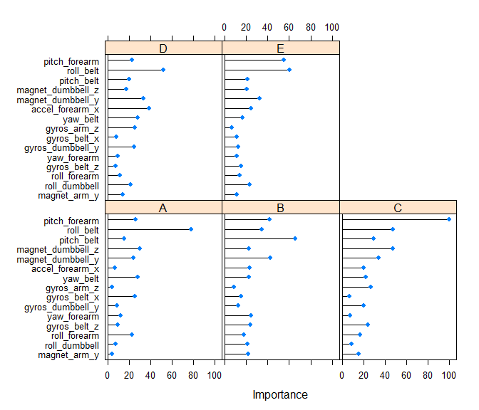

# Weight lifting prediction - Final Project
Luis Peraza  
16 July 2016  

##Synopsis

In this project, we will perform prediction for weight lifting styles. The aim of this assignment is to infer between the most common errors when doing a dumbell curl and classify/predict when these errors occur, in order to tell the perfomer that correction is needed.

A complete explanation of the experiment can be found here: http://groupware.les.inf.puc-rio.br/har. During the original experiments, the researchers invited six young healthy participants to do 10 repetitions of dumbell curls in 5 different ways; the correct one and four common errors. All the participants were supervised by an experienced trainer to perfectly reproduce the common errors and the correct exercise. The classification was as follows:

A: Exactly according to the specification, 
B: Throwing the elbows to the front,
C: Lifting the dumbbell only halfway, 
D: Lowering the dumbbell only halfway, 
E: Throwing the hips to the front,

Our final aim is to emulate the original results from this study and which were published in Velloso et al. (2013), who reported an accuracy of 99.9%

Let's start the analysis by loading the Weight Lifting Experiment dataset


```r
library(caret)
library(dplyr)
training <- read.csv('pml-training.csv', header = TRUE)
```

Notice that I also loaded the libraries caret for modelling and dplyr for data frame manipulation.

Inspect the training dataset, just the first 20 variables,


```r
dim(training)
```

```
## [1] 19622   160
```

```r
str(training, list.len=20)
```

```
## 'data.frame':	19622 obs. of  160 variables:
##  $ X                       : int  1 2 3 4 5 6 7 8 9 10 ...
##  $ user_name               : Factor w/ 6 levels "adelmo","carlitos",..: 2 2 2 2 2 2 2 2 2 2 ...
##  $ raw_timestamp_part_1    : int  1323084231 1323084231 1323084231 1323084232 1323084232 1323084232 1323084232 1323084232 1323084232 1323084232 ...
##  $ raw_timestamp_part_2    : int  788290 808298 820366 120339 196328 304277 368296 440390 484323 484434 ...
##  $ cvtd_timestamp          : Factor w/ 20 levels "02/12/2011 13:32",..: 9 9 9 9 9 9 9 9 9 9 ...
##  $ new_window              : Factor w/ 2 levels "no","yes": 1 1 1 1 1 1 1 1 1 1 ...
##  $ num_window              : int  11 11 11 12 12 12 12 12 12 12 ...
##  $ roll_belt               : num  1.41 1.41 1.42 1.48 1.48 1.45 1.42 1.42 1.43 1.45 ...
##  $ pitch_belt              : num  8.07 8.07 8.07 8.05 8.07 8.06 8.09 8.13 8.16 8.17 ...
##  $ yaw_belt                : num  -94.4 -94.4 -94.4 -94.4 -94.4 -94.4 -94.4 -94.4 -94.4 -94.4 ...
##  $ total_accel_belt        : int  3 3 3 3 3 3 3 3 3 3 ...
##  $ kurtosis_roll_belt      : Factor w/ 397 levels "","-0.016850",..: 1 1 1 1 1 1 1 1 1 1 ...
##  $ kurtosis_picth_belt     : Factor w/ 317 levels "","-0.021887",..: 1 1 1 1 1 1 1 1 1 1 ...
##  $ kurtosis_yaw_belt       : Factor w/ 2 levels "","#DIV/0!": 1 1 1 1 1 1 1 1 1 1 ...
##  $ skewness_roll_belt      : Factor w/ 395 levels "","-0.003095",..: 1 1 1 1 1 1 1 1 1 1 ...
##  $ skewness_roll_belt.1    : Factor w/ 338 levels "","-0.005928",..: 1 1 1 1 1 1 1 1 1 1 ...
##  $ skewness_yaw_belt       : Factor w/ 2 levels "","#DIV/0!": 1 1 1 1 1 1 1 1 1 1 ...
##  $ max_roll_belt           : num  NA NA NA NA NA NA NA NA NA NA ...
##  $ max_picth_belt          : int  NA NA NA NA NA NA NA NA NA NA ...
##  $ max_yaw_belt            : Factor w/ 68 levels "","-0.1","-0.2",..: 1 1 1 1 1 1 1 1 1 1 ...
##   [list output truncated]
```

First we see that it is a very large dataset, comprised by the raw measures from the accelerometers and statistics from these measures (stddev, kurtosis, var, etc) and which were estimated in windows of 2.5 secs according to the dataset description. Many of these are NAs and we won't use them in the prediction task. The assigment also asked to download the testing (for evaluation) dataset which doesn't have the statistic measures but it the has same number of variables.


```r
  evaldata <- read.csv('pml-testing.csv', header = TRUE)
```

Noticed then that we will need to choose from the training dataset the correct predictors for classification, i.e. ignoring the statistic variables. For this we can use the grep function to select variables or other approach, but in this case we can use the evaluation dataset to get the needed indices by not choosing the columns with NAs.


```r
  subtraining <- training[, colSums(is.na(evaldata)) == 0]
```

Hence, we have used in our advantage that the testing dataset has NA values in all the summarizing statistics,and we decided not to select those columns. We can inspect the subtraining dataset and see that it only has the raw sensor variables; a total of 52 predictors and the "classe" variable with the correct dumbbell curl class.


```r
  names(subtraining)
```

```
##  [1] "X"                    "user_name"            "raw_timestamp_part_1"
##  [4] "raw_timestamp_part_2" "cvtd_timestamp"       "new_window"          
##  [7] "num_window"           "roll_belt"            "pitch_belt"          
## [10] "yaw_belt"             "total_accel_belt"     "gyros_belt_x"        
## [13] "gyros_belt_y"         "gyros_belt_z"         "accel_belt_x"        
## [16] "accel_belt_y"         "accel_belt_z"         "magnet_belt_x"       
## [19] "magnet_belt_y"        "magnet_belt_z"        "roll_arm"            
## [22] "pitch_arm"            "yaw_arm"              "total_accel_arm"     
## [25] "gyros_arm_x"          "gyros_arm_y"          "gyros_arm_z"         
## [28] "accel_arm_x"          "accel_arm_y"          "accel_arm_z"         
## [31] "magnet_arm_x"         "magnet_arm_y"         "magnet_arm_z"        
## [34] "roll_dumbbell"        "pitch_dumbbell"       "yaw_dumbbell"        
## [37] "total_accel_dumbbell" "gyros_dumbbell_x"     "gyros_dumbbell_y"    
## [40] "gyros_dumbbell_z"     "accel_dumbbell_x"     "accel_dumbbell_y"    
## [43] "accel_dumbbell_z"     "magnet_dumbbell_x"    "magnet_dumbbell_y"   
## [46] "magnet_dumbbell_z"    "roll_forearm"         "pitch_forearm"       
## [49] "yaw_forearm"          "total_accel_forearm"  "gyros_forearm_x"     
## [52] "gyros_forearm_y"      "gyros_forearm_z"      "accel_forearm_x"     
## [55] "accel_forearm_y"      "accel_forearm_z"      "magnet_forearm_x"    
## [58] "magnet_forearm_y"     "magnet_forearm_z"     "classe"
```

Here comes the exciting part. In the original research article by Velloso et al. (2013), which can be found in the link above and in this repo, the authors reported that they applied random forest classifiers and a bagging approach. At the beggining I was a little confused because random forest is already a bagged classifier. But it seems that the authors "rebagged" the random forest models. Hence, they bagged 10 random forest models where each forest was comprised of 10 trees, and the validation was perfomed with a 10-fold cross-validation per forest. At the moment, I ignore if the number 10 (which was chosen for all the parameters) has an impact in the performance, but this was the authors' approach.

Hence, I decided to emulate the authors' solution in my model and program the bagging myself. The bagging philosophy has three stages: 1) boostrap resampling, 2) Estimate several models, and 3) assemble the models using any approach, e.g majority vote.

Let's create our new subtraining and subtesting samples which will be independent,


```r
set.seed(4332)
inTrain <- createDataPartition(subtraining$classe, p=0.8, list=FALSE)
subtesting <-subtraining[-inTrain,]
subtraining <- subtraining[inTrain,]
```

Notice that we have allocated 80% of the samples for training and the 20% for testing. Now we can start with the bagging procedure. First we get the bootstrap indices,


```r
resampled <- createResample(subtraining$classe, times=10, list=FALSE)
```

The function createResample does a balanced boostraping for us (sampling with replacement), where all levels of the factor variable "classe"" will be represented. It is very important that classe is declared a as factor variable here, if it were numeric it may happen that some levels are missed in the new datasets. The variable resampled has the indices we need to create new bootstrapped datasets. 
Now we can create our 10 random forests with a for loop and save them in a list.


```r
#Create an empty model list where we will save the 10 random forest models
modlist <-list()
for(iter in 1:10){
  #Perform the resampling with replacement
  DataResampled <- subtraining[resampled[,iter],-(1:7)]
  #No partition will be created, since we are bootstraping the sample
  modrf <- train(classe ~ ., method = "rf", #We chose random forests as our model
                             data = DataResampled, #The bootstrapped dataset
                             importance = TRUE, #Tell me the variable importance 
                             trControl = trainControl(method = "cv", number = 10), #10-Fold CrossVal
                             ntree = 10) # VERY IMPORTANT! specify 10 trees in the forest
  modlist[[iter]] <- modrf #Save the model in the list
  print(iter) #Just count which model is being estimated
}
#Save the list of models (the lines above take time, better to save it)
save(modlist,file="modALLRF.RData")
```

We have decided to save the list of models because the estimation takes a lot time, depending on our processor. Load the models again


```r
load("modALLRF.RData")
```

The next step is to wrap the 10 random forest models in one, by training a new model. In this case a linear discriminant:


```r
newpredictors <- sapply(modlist, function(x) predict(x,subtraining))
assembledData <- data.frame(newpredictors, classe=subtraining$classe)
combModlda<- train(classe~., data = assembledData, method="lda")
```

Notice that we have use the original subtraining set without bootstrapping. We can now create a prediction function that wraps all in one for future unknown samples:


```r
MycombRFpredict<- function(modlist,combModlda, newdata){ #10 random forest list and model wrapper
  newpredictors <- sapply(modlist, function(x) predict(x,newdata)) #Do all predictions per forest
  assembledData <- data.frame(newpredictors) #Paste random names Xs to the variables
  combpred <- predict(combModlda, assembledData) #Predict the new variables with an LDA model
  combpred
}
```

Now we can evaluate the perfomance of the 10 random forests. First, we will call the function designed above and then use the confusionMatrix R function to estimate performance. We use the subtesting sample we create at the very beggining of our analysis and which is independent from the training set.


```r
combinePred <- MycombRFpredict(modlist, combModlda ,subtesting)
confusionMatrix(combinePred, subtesting$classe)
```

```
## Confusion Matrix and Statistics
## 
##           Reference
## Prediction    A    B    C    D    E
##          A 1116   14    0    0    0
##          B    0  744    8    0    0
##          C    0    1  675   12    0
##          D    0    0    1  630    1
##          E    0    0    0    1  720
## 
## Overall Statistics
##                                           
##                Accuracy : 0.9903          
##                  95% CI : (0.9867, 0.9931)
##     No Information Rate : 0.2845          
##     P-Value [Acc > NIR] : < 2.2e-16       
##                                           
##                   Kappa : 0.9877          
##  Mcnemar's Test P-Value : NA              
## 
## Statistics by Class:
## 
##                      Class: A Class: B Class: C Class: D Class: E
## Sensitivity            1.0000   0.9802   0.9868   0.9798   0.9986
## Specificity            0.9950   0.9975   0.9960   0.9994   0.9997
## Pos Pred Value         0.9876   0.9894   0.9811   0.9968   0.9986
## Neg Pred Value         1.0000   0.9953   0.9972   0.9960   0.9997
## Prevalence             0.2845   0.1935   0.1744   0.1639   0.1838
## Detection Rate         0.2845   0.1897   0.1721   0.1606   0.1835
## Detection Prevalence   0.2880   0.1917   0.1754   0.1611   0.1838
## Balanced Accuracy      0.9975   0.9889   0.9914   0.9896   0.9992
```

For the testing set, we reached an accuracy of 99.03%

##For curiosity...

Do you remember that we asked to the train function to estimate variable importance? We can use it to visualize which variables are the most important for classification from any of the 10 random forest models in our list. For instance


```r
plot(varImp(modlist[[1]]),top = 15)
```

<!-- -->

    Figure 1. Variable importance

In Figure 1 we have plotted the first 15 most important variables for the 1st model. These slighly vary between models and the order depends on the bootstraping stage of our analysis.

##Conclusion

For a completely independent test sample, subtesting, our combination of random forests reached an accuracy of 99.03% which is really good. Velloso et al. (2013) reported an accuracy of 99.9% which is awesome and we were not that far with our bagged model.

I hope you enjoyed my solution to this project. 

Cheers!

###Reference

Velloso, E.; Bulling, A.; Gellersen, H.; Ugulino, W.; Fuks, H. Qualitative Activity Recognition of Weight Lifting Exercises. Proceedings of 4th International Conference in Cooperation with SIGCHI (Augmented Human '13) . Stuttgart, Germany: ACM SIGCHI, 2013.

Read more: http://groupware.les.inf.puc-rio.br/har#ixzz4EavvqJc1


